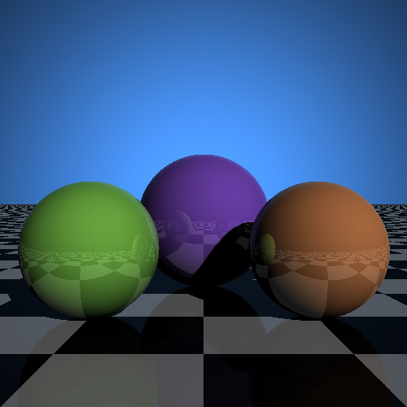
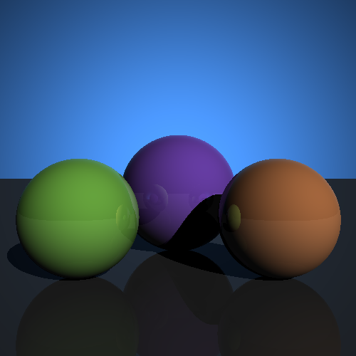

# Ray Tracer (hard-coded values)

This is a simple ray tracer written in Vulkan.

The actual "Vulkan" part of this project sets up a compute shader and reads the result, then writes it into a `.png` file.

There is only a compute shader in this project, it's where the ray tracing is completely described (here there are no data sent through buffers to the shader, everything is defined in the shader itself based on the pixel we are rendering). The ray tracer is really simple, with just an infinite ground floor, a directional light and some spheres placed around. There is no AA, nothing too fancy in it, it just serves as an example of what is possible.

The code is commented to explain what is happening in each step, and why we need it.

